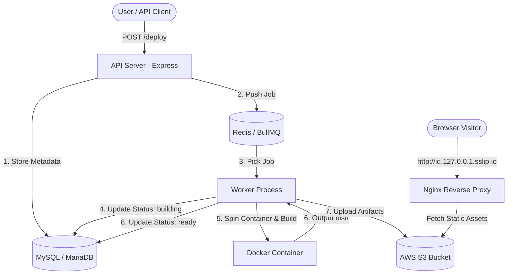

# 🚀 Vercel Clone — Self-Hosted Managed Deployment Platform

A production-grade, self-hosted deployment platform inspired by Vercel. Provide a GitHub repository URL, and the system automatically clones, builds in isolated Docker containers, uploads static artifacts to AWS S3, and serves live sites on custom subdomains via an Nginx reverse proxy.

---

## 🏗️ Architecture Overview



### Flow Breakdown
1. **API Server (`api-server`)**: Accepts deployment requests (`POST /deploy`), persists job metadata into MySQL, and pushes jobs to Redis queue.
2. **Asynchronous Queue (`BullMQ + Redis`)**: Decouples API responses from long-running build processes.
3. **Worker (`worker`)**: Listens to queue, provisions Docker containers to safely clone and execute `npm install && npm run build`.
4. **Cloud Storage (`AWS S3`)**: Stores processed static build outputs (`dist/` / `build/`) under `deployments/<deploymentId>/`.
5. **Reverse Proxy (`proxy/nginx`)**: Extracts deployment ID from request subdomains (`<deploymentId>.127.0.0.1.sslip.io`) and dynamically routes traffic to corresponding AWS S3 objects.

---

## 🛠️ Tech Stack

| Layer | Technology | Description |
| :--- | :--- | :--- |
| **API Framework** | Node.js + Express | RESTful API endpoints for job creation & status querying |
| **Database** | MySQL / MariaDB | Deployment status tracking and metadata persistence |
| **Job Queue** | BullMQ + Redis | Reliable asynchronous background task distribution |
| **Build Isolation** | Docker | Containerized build runner environment |
| **Storage** | AWS S3 | Object storage hosting static web assets |
| **Reverse Proxy** | Nginx | Wildcard subdomain extraction and proxy routing |
| **AWS SDK** | `@aws-sdk/client-s3` | Programmatic file upload & management |

---

## 📂 Repository Structure

```
vercel-clone/
├── api-server/             # Express API Server
│   ├── db/                 # Database connection & migrations
│   ├── routes/             # API routes (/deploy)
│   ├── index.js            # Express entry point
│   └── queue.js            # BullMQ queue producer
│
├── worker/                 # Background Job Processor
│   ├── executor.js         # Docker run, Git clone & build pipeline
│   ├── uploader.js         # AWS S3 recursive file uploader
│   ├── worker.js           # BullMQ consumer entry point
│   └── test-s3.js          # S3 connectivity test script
│
├── proxy/                  # Nginx Reverse Proxy
│   └── nginx.conf          # Wildcard subdomain proxy rules
│
├── docker/                 # Build Runner Container Setup
│   └── Dockerfile          # Isolated Node.js build runner base image
│
├── GEMINI.md               # Architecture details & schema reference
└── README.md               # Documentation
```

---

## ⚡ Quick Start & Setup

### 1. Environment Setup
Create `.env` configuration files inside `api-server/.env` and `worker/.env`:

```env
PORT=3000
DB_HOST=localhost
DB_USER=root
DB_PASSWORD=your_mysql_password
DB_NAME=vercel_clone

REDIS_HOST=127.0.0.1
REDIS_PORT=6379

AWS_ACCESS_KEY_ID=your_aws_access_key
AWS_SECRET_ACCESS_KEY=your_aws_secret_key
AWS_REGION=ap-south-1
AWS_BUCKET_NAME=kritesh-vercel-clone-outputs
```

### 2. Database Schema
Run the following SQL migration in MySQL/MariaDB:

```sql
CREATE DATABASE IF NOT EXISTS vercel_clone;
USE vercel_clone;

CREATE TABLE IF NOT EXISTS deployments (
  id VARCHAR(36) PRIMARY KEY,
  repo_url VARCHAR(500) NOT NULL,
  status ENUM('queued', 'building', 'ready', 'failed') DEFAULT 'queued',
  created_at TIMESTAMP DEFAULT CURRENT_TIMESTAMP
);
```

### 3. Start Redis & MySQL Services
Ensure Redis and MySQL/MariaDB are running locally:
```bash
sudo systemctl start redis
sudo systemctl start mariadb
```

### 4. Start Services

**API Server:**
```bash
cd api-server
npm install
npm run start
```

**Worker Engine:**
```bash
cd worker
npm install
node worker.js
```

---

## 📡 API Endpoints

### 1. Request Deployment
* **Endpoint:** `POST /deploy`
* **Headers:** `Content-Type: application/json`
* **Body:**
```json
{
  "repoUrl": "https://github.com/user/repo"
}
```
* **Response (200 OK):**
```json
{
  "deploymentId": "b3a1d94e-7f12-4c22-9213-a4e82b7df901",
  "status": "queued",
  "message": "Deployment queued successfully"
}
```

### 2. Check Deployment Status
* **Endpoint:** `GET /deploy/:id`
* **Response (200 OK):**
```json
{
  "id": "b3a1d94e-7f12-4c22-9213-a4e82b7df901",
  "repo_url": "https://github.com/user/repo",
  "status": "ready",
  "created_at": "2026-08-01T14:00:00.000Z"
}
```

---

## 🌐 Subdomain Access & Routing

Deployments are hosted automatically on subdomains once the status reaches `ready`:

```
http://<deploymentId>.127.0.0.1.sslip.io
```

Nginx dynamically parses `<deploymentId>` from incoming requests and proxies the request to AWS S3 (`https://kritesh-vercel-clone-outputs.s3.ap-south-1.amazonaws.com/deployments/<deploymentId>/index.html`).

---

## 📈 Implementation Milestones

- [x] **Phase 1 — API Server:** REST endpoints & MySQL database integration.
- [x] **Phase 2 — Queue System:** BullMQ queue producer/consumer with Redis.
- [x] **Phase 3 — Docker Build Runner:** Automated repo cloning & containerized build runner.
- [x] **Phase 4 — AWS S3 Upload:** Recursive asset upload via AWS SDK v3.
- [x] **Phase 5 — Nginx Reverse Proxy:** Wildcard subdomain proxying & SPA routing.
